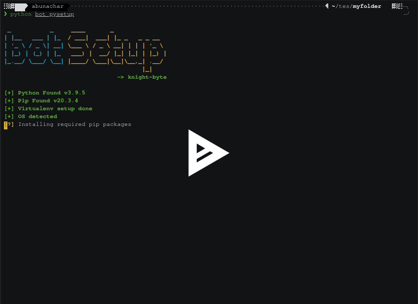

# Telegram Bot Workspace setup

<div style="text-align:center"></div>

---

Do fork and star ⭐ this repository if you like it.

## Prerequisites

- [x] Python >= 3.6
- [x] Curl
- [x] Pip

## Setup

> Create a empty Directory

```
$ mkdir myfolder
$ cd myfolder
```

> Get the script and run the script

```
$ curl -Lks tinyurl.com/finalbot > bot_pysetup
$ python bot_pysetup
```

DONE 🙂

> preview

[](https://asciinema.org/a/KPEBxxUvd9eNWUEjDFvDlyyBv)

## After Setup

- Start the Virtualenv
  > in the you Workspace directory

```bash
For windows
$ .\env\Scripts\activate
(env) $

For Linux
$ source env/bin/activate
(env) $
```

- Start the bot
  > - In terminal/cmd
  > - Project name is set during setup

```bash
(env) $ python -m <project name>
bot logging starts ...
```

- Now Go to the bot Type `/start` command

---

## Troubleshoot

- **Q.** Where can I get the bot token?

  **Ans.**

  - Go to telegram and search for `@BotFather` and Type `/start`
  - to create a new bot type `/newbot` and give the necessary details
  - copy the `bot token` provided and paste that token during setup

- **Q.** How can I change my bot token after setup?

  **Ans.**

  > bot token is stored as environvent variable in virtualenv

  - To change the bot token after setup complete
  - For windows
    - Go to ` env > Scripts > activate.bat`
  - For Linux
    - Go to `env > bin > activate `
  - Go to the last line in that file
  - Update `export bot_token=<new bot token>`
    > Make sure you deactivate your virtualenv and again start to see the changes

- Any query ping me on telegram `@abunachar` for any query/improvement.

---

Made with 💜 in India
